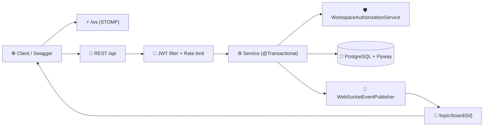

<p align="center">
  
</p>

<p align="center">
  
</p>

<p align="center">
  
  
  
  
  
  
  
</p>

<p align="center">
  <a href="https://task-centr-backend.onrender.com/swagger-ui/index.html">📖 Swagger UI</a> •
  <a href="https://task-centr-backend.onrender.com/actuator/health">💚 Health</a>
</p>

## Texnologiyalar

- **Java 17**, **Spring Boot 3.2.5** (Web, Data JPA, Security, Validation, Cache, Actuator)
- **PostgreSQL** + **Flyway** migratsiyalar (`src/main/resources/db/migration`)
- **JWT** autentifikatsiya (`jjwt 0.11.5`)
- **WebSocket / STOMP** real-time board yangilanishlar (`/ws`, `/topic/board/{workspaceId}`)
- **JUnit 5 + Mockito + MockMvc** testlar, **springdoc-openapi** (Swagger UI)
- Caching (Caffeine), rate limiting (Bucket4j), Prometheus metrikalar

<p align="center">
  <a href="https://skillicons.dev"></a>
</p>

## Asosiy imkoniyatlar

- JWT autentifikatsiya (register / login, 7 kunlik tokenlar) va rollar (`USER`, `ADMIN`)
- Workspace → Board → Column → Task ierarxiyasi, a'zolar va rollar (`OWNER`, `ADMIN`, `MEMBER`)
- Jira-uslubidagi public task ID'lar (`TC-1`, `TC-2`, …), global unikal key prefikslar (`WR` → `WR2` …)
- Pessimitic locking (`SELECT … FOR UPDATE`) bilan race-condition'siz counter
- WebSocket/STOMP orqali real-time yangilanishlar: task/column/label create, update, delete eventlari
- Label'lar, task biriktirish (assignee), ustuvorlik (priority), due date
- Hamma joyda soft delete, Flyway sxema boshqaruvi, profil statistikasi (`GET /api/me/stats`)

## Arxitektura

Qatlamli Spring Boot loyiha. Controller'lar HTTP + JWT user'ni qabul qiladi,
servislar tranzaksiya va ruxsat tekshiruvlarini bajaradi (`WorkspaceAuthorizationService`),
repository'lar Spring Data JPA interfeyslari (ayrimlarida `@EntityGraph` / pessimistic lock).

```
src/main/java/com/taskcenter/
├── controller/   # AuthController, WorkspaceController, BoardController, UserController
├── service/      # AuthService, WorkspaceService, BoardService, WorkspaceAuthorizationService, WebSocketEventPublisher
├── repository/   # User, Workspace, WorkspaceMember, Column, Task, Label repository'lar
├── model/        # JPA entity'lar (User, Workspace, BoardColumn, Task, Label, …)
├── dto/          # Request/response DTO'lar (TaskCreateRequest, BoardEvent, UserStatsDto, …)
├── security/     # JwtTokenProvider, JwtAuthenticationFilter, rate limiting
├── config/       # Security, WebSocket/STOMP, cache, Swagger, seed data
├── exception/    # GlobalExceptionHandler + ApiResponse o'rami
└── monitoring/   # Health indicatorlar, request logging
src/main/resources/db/migration/  # Flyway migratsiyalar V1..V10
```

So'rov oqimi:



## Ishga tushirish

**Talablar:** Java 17+, PostgreSQL 14+, Maven (loyihada `mvnw` wrapper bor, alohida o'rnatish shart emas).

1. Bazani yarating:
   ```sql
   CREATE DATABASE taskcenter;
   ```
2. `.env.example` ni `.env` ga nusxalang (yoki o'zgaruvchilarni export qiling) va to'ldiring:
   ```env
   SPRING_DATASOURCE_URL=jdbc:postgresql://localhost:5432/taskcenter
   SPRING_DATASOURCE_USERNAME=postgres
   SPRING_DATASOURCE_PASSWORD=password
   JWT_SECRET=your-secret-here-min-256-bits-long-for-hs256
   JWT_EXPIRATION=604800000
   PORT=8080
   ```
3. Yurgizing (Flyway sxemani avtomatik migratsiya qiladi):
   ```bash
   ./mvnw spring-boot:run
   ```
4. Swagger UI: `http://localhost:8080/swagger-ui/index.html`

> Avval `POST /api/auth/register` orqali ro'yxatdan o'ting, tokenni nusxalang, Swagger'da **Authorize** tugmasini bosib `Bearer <token>` kiriting.

### Real-time yangilanishlar (WebSocket)

- Ulanish (STOMP + SockJS): `ws://<host>/ws?token=<JWT>`
- Obuna: `/topic/board/{workspaceId}` (faqat a'zo bo'lgan workspace'lar; boshqasi rad etiladi)
- Event formati: `{ "type": "TASK_CREATED|TASK_UPDATED|…", "data": { … } }`

## API ro'yxati

Hamma javob `{ "success", "message", "data", "timestamp" }` o'ramida qaytadi.

| Metod | Path | Tavsif | Auth |
|---|---|---|---|
| POST | `/api/auth/register` | Ro'yxatdan o'tish, JWT beradi (201) | Yo'q |
| POST | `/api/auth/login` | Kirish, JWT beradi | Yo'q |
| GET | `/api/me`, `/api/auth/me` | Joriy user | Ha |
| GET | `/api/me/stats` | `{taskCount, workspaceCount}` — profil uchun | Ha |
| GET | `/api/users` | Userlar ro'yxati (paged) | Admin |
| GET | `/api/workspaces?page=&size=` | Mening workspace'larim | Ha |
| POST | `/api/workspaces` | Workspace yaratish (unikal key prefix) | Ha |
| GET | `/api/workspaces/{id}` | Workspace tafsiloti | A'zo |
| PUT | `/api/workspaces/{id}` | Workspace yangilash | Owner |
| DELETE | `/api/workspaces/{id}` | Workspace o'chirish (soft) | Owner |
| POST | `/api/workspaces/{workspaceId}/members?userId=` | A'zo qo'shish | Owner/Admin |
| DELETE | `/api/workspaces/{workspaceId}/members/{userId}` | A'zo o'chirish | Owner/Admin |
| GET | `/api/workspaces/{workspaceId}/board` | To'liq board: card'li column'lar | A'zo |
| GET/POST | `/api/workspaces/{workspaceId}/columns` | Column ro'yxati / yaratish | A'zo / Owner/Admin |
| PUT/PATCH | `/api/workspaces/{workspaceId}/columns/{id}` | Column yangilash | Owner/Admin |
| PATCH | `/api/workspaces/{workspaceId}/columns` | Column tartibini o'zgartirish | Owner/Admin |
| DELETE | `/api/workspaces/{workspaceId}/columns/{id}` | Column o'chirish | Owner/Admin |
| GET | `/api/workspaces/{workspaceId}/tasks?page=&size=` | Task ro'yxati (paged) | A'zo |
| GET | `/api/workspaces/{workspaceId}/tasks/{id}` | Task tafsiloti | A'zo |
| POST | `/api/workspaces/{workspaceId}/tasks` | Task yaratish (`TC-N` id) | A'zo |
| PUT/PATCH | `/api/workspaces/{workspaceId}/tasks/{id}` | Task yangilash | A'zo |
| DELETE | `/api/workspaces/{workspaceId}/tasks/{id}` | Task o'chirish | A'zo |
| PATCH | `/api/workspaces/{workspaceId}/tasks/{taskId}/column/{columnId}` | Task ko'chirish | A'zo |
| PUT | `/api/workspaces/{workspaceId}/tasks/{taskId}/assignee/{userId}` | User biriktirish | A'zo |
| POST/DELETE | `/api/workspaces/{workspaceId}/tasks/{taskId}/labels/{labelId}` | Label qo'shish/olib tashlash | A'zo |
| GET/POST | `/api/workspaces/{workspaceId}/labels` | Label ro'yxati / yaratish | A'zo / Owner/Admin |
| DELETE | `/api/workspaces/{workspaceId}/labels/{id}` | Label o'chirish | Owner/Admin |
| GET | `/api/workspaces/{workspaceId}/members` | A'zolar ro'yxati | A'zo |
| GET | `/actuator/health`, `/actuator/metrics`, `/actuator/prometheus` | Operatsion endpointlar | Yo'q |

## Testlar

```bash
./mvnw test
```

Mockito unit testlar + H2 da MockMvc integratsiya testlar, shuningdek live serverni tekshiradigan
PowerShell smoke skript (`swagger_smoke_test.ps1`) bor.

## Litsenziya

MIT. Muallif: `otabek-4662`.

<p align="center">
  
</p>
