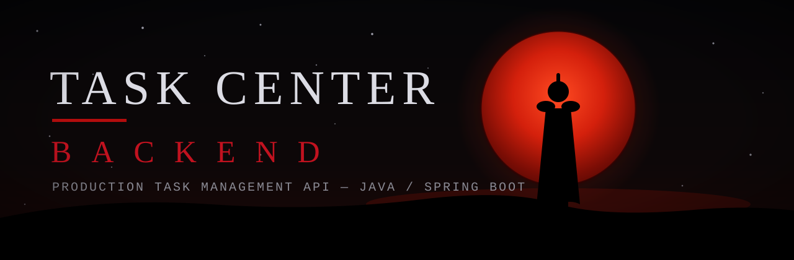
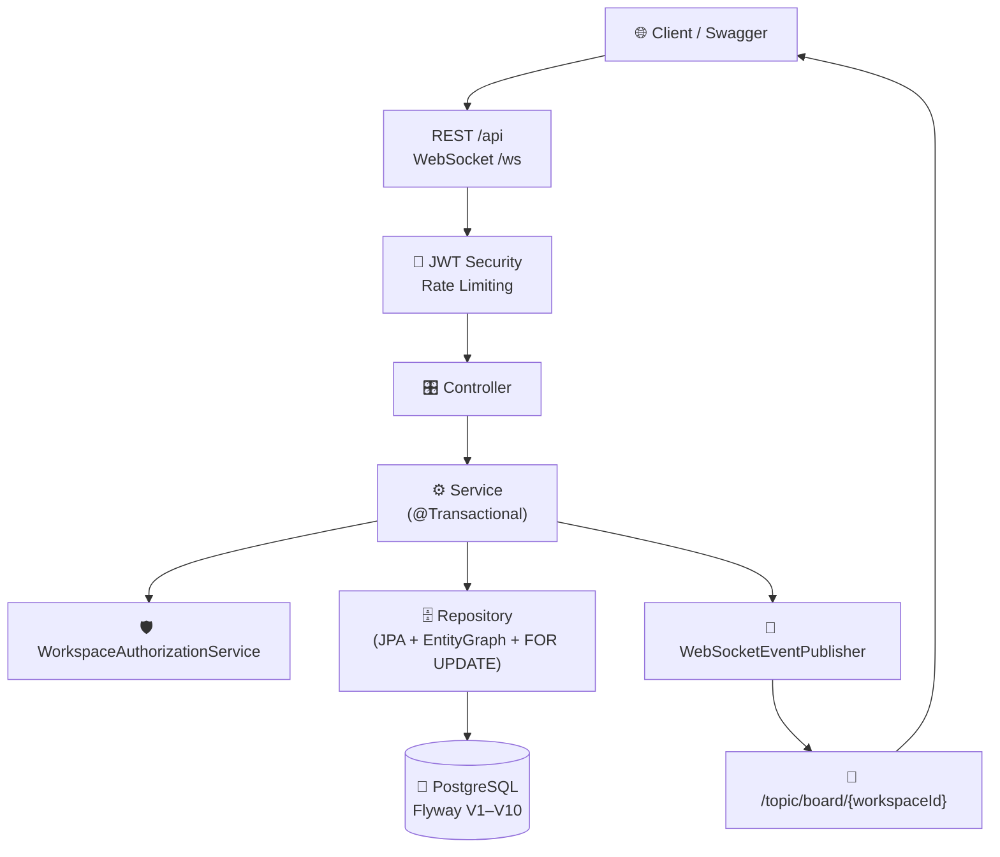

<div align="center">

<p align="center">
  
</p>

# ⚔️ TASK CENTER BACKEND

**Production-oriented task management backend built with Java & Spring Boot.**

*Discipline in architecture. Endurance under load. Every request earns its passage.*


[📖 Swagger UI](https://task-centr-backend.onrender.com/swagger-ui/index.html) · [💚 Health](https://task-centr-backend.onrender.com/actuator/health) · [📦 Repository](https://github.com/otabek-4662/task_centr_backend)

<p align="center"><i>⚔️ "Struggle, endure, contend. For that alone is the sword of one who defies death." — Berserk</i></p>

</div>

---

## Loyiha haqida

**Task Center** — jamoalar uchun Jira-uslubidagi task boshqaruv tizimi backend'i. Har bir task global unikal public ID oladi (`TC-1`, `TC-2`), har bir board o'zgarishi millisekundlarda barcha ochiq mijozlarga yetkaziladi.

```
User → Workspace → Board → Columns → Tasks
```

---

## Asosiy imkoniyatlar

| Soha | Qurol-aslaha |
|---|---|
| **Autentifikatsiya** | JWT (7 kunlik token), `USER` / `ADMIN` rollari |
| **Ruxsatlar** | Workspace a'zoligi + `OWNER` / `ADMIN` / `MEMBER` ierarxiyasi |
| **Board** | Column yaratish, tartiblash, ko'chirish; to'liq board bitta so'rovda |
| **Tasklar** | Yaratish, yangilash, ustunlararo ko'chirish, biriktirish, ustuvorlik, due date |
| **Label'lar** | Rangli label'lar, taskga qo'shish/olib tashlash |
| **Identifikatsiya** | `TC-N` public ID'lar, workspace'lararo unikal key prefikslar (`WR` → `WR2`) |
| **Real-time** | WebSocket/STOMP eventlar: created / updated / deleted / moved |
| **Ma'lumot** | Soft delete, Flyway migratsiyalar (V1–V10) |
| **Chidamlilik** | Pessimistic locking, rate limiting, cache, metrics |

---

## Arxitektura



Har bir yozish operatsiyasi uchta darvozadan o'tadi: **autentifikatsiya** (kim?), **avtorizatsiya** (qaysi workspace'da qanday rol?), **tranzaksiya** (atomarlik + qulflash).

### Paket strukturasi

```
src/main/java/com/taskcenter/
├── controller/   # Auth, Workspace, Board, User — HTTP kirish nuqtalari
├── service/      # Auth, Workspace, Board, Authorization, WebSocketEventPublisher
├── repository/   # Spring Data JPA (User, Workspace, Column, Task, Label)
├── model/        # JPA entity'lar
├── dto/          # Request/response DTO'lar
├── security/     # JwtTokenProvider, JwtAuthenticationFilter, rate limit
├── config/       # Security, WebSocket/STOMP, cache, Swagger, seed
├── exception/    # GlobalExceptionHandler + ApiResponse o'rami
└── monitoring/   # Health, request logging
```

---

## Autentifikatsiya oqimi

```
Register → Login → JWT → Authorization header → Protected API
```

1. `POST /api/auth/register` yoki `/api/auth/login` → `{ token, user }`
2. Swagger'da **Authorize** → `Bearer <token>`
3. Har bir himoyalangan so'rovda `Authorization: Bearer <token>` header
4. `JwtAuthenticationFilter` tokenni tekshiradi, rolni `SecurityContext` ga qo'yadi

---

## Workspace / Board modeli

```
User ──(OWNER / ADMIN / MEMBER)──▶ Workspace ──▶ Board ──▶ Columns ──▶ Tasks
```

| Rol | Imkoniyat |
|---|---|
| `OWNER` | Hamma narsa: sozlash, a'zo boshqaruv, o'chirish |
| `ADMIN` | Column/label/a'zo boshqaruv (o'chirishdan tashqari kritik amallar) |
| `MEMBER` | Board ko'rish, task yaratish/yangilash/ko'chirish |

---

## API ro'yxati

Hamma javob `{ "success", "message", "data", "timestamp" }` o'ramida.

| Metod | Endpoint | Tavsif | Auth |
|---|---|---|---|
| POST | `/api/auth/register` | Ro'yxatdan o'tish, JWT (201) | Yo'q |
| POST | `/api/auth/login` | Kirish, JWT | Yo'q |
| GET | `/api/me`, `/api/auth/me` | Joriy user | Ha |
| GET | `/api/me/stats` | `{taskCount, workspaceCount}` | Ha |
| GET | `/api/users` | Userlar (paged) | Admin |
| GET | `/api/workspaces?page=&size=` | Mening workspace'larim | Ha |
| POST | `/api/workspaces` | Workspace yaratish | Ha |
| GET | `/api/workspaces/{id}` | Tafsilot | A'zo |
| PUT | `/api/workspaces/{id}` | Yangilash | Owner |
| DELETE | `/api/workspaces/{id}` | O'chirish (soft) | Owner |
| POST | `/api/workspaces/{wid}/members?userId=` | A'zo qo'shish | Owner/Admin |
| DELETE | `/api/workspaces/{wid}/members/{userId}` | A'zo o'chirish | Owner/Admin |
| GET | `/api/workspaces/{wid}/board` | To'liq board | A'zo |
| GET/POST | `/api/workspaces/{wid}/columns` | Ro'yxat / yaratish | A'zo / Owner/Admin |
| PUT/PATCH | `/api/workspaces/{wid}/columns/{id}` | Yangilash | Owner/Admin |
| PATCH | `/api/workspaces/{wid}/columns` | Tartiblash | Owner/Admin |
| DELETE | `/api/workspaces/{wid}/columns/{id}` | O'chirish | Owner/Admin |
| GET | `/api/workspaces/{wid}/tasks?page=&size=` | Tasklar (paged) | A'zo |
| GET | `/api/workspaces/{wid}/tasks/{id}` | Tafsilot | A'zo |
| POST | `/api/workspaces/{wid}/tasks` | Yaratish (`TC-N`) | A'zo |
| PUT/PATCH | `/api/workspaces/{wid}/tasks/{id}` | Yangilash | A'zo |
| DELETE | `/api/workspaces/{wid}/tasks/{id}` | O'chirish | A'zo |
| PATCH | `/api/workspaces/{wid}/tasks/{tid}/column/{cid}` | Ko'chirish | A'zo |
| PUT | `/api/workspaces/{wid}/tasks/{tid}/assignee/{uid}` | Biriktirish | A'zo |
| POST/DELETE | `/api/workspaces/{wid}/tasks/{tid}/labels/{lid}` | Label +/- | A'zo |
| GET/POST | `/api/workspaces/{wid}/labels` | Ro'yxat / yaratish | A'zo / Owner/Admin |
| DELETE | `/api/workspaces/{wid}/labels/{id}` | O'chirish | Owner/Admin |
| GET | `/api/workspaces/{wid}/members` | A'zolar | A'zo |
| GET | `/actuator/health`, `/metrics`, `/prometheus` | Monitoring | Yo'q |

---

## Real-time tizim

STOMP + SockJS. Ulanish: `ws://<host>/ws?token=<JWT>` — tokensiz handshake rad etiladi.
Obuna: `/topic/board/{workspaceId}` — faqat a'zo bo'lgan workspace'lar; begona obuna rad etiladi.

| Event | Qachon |
|---|---|
| `TASK_CREATED` / `TASK_UPDATED` / `TASK_DELETED` | Task CRUD |
| `COLUMN_CREATED` / `COLUMN_UPDATED` / `COLUMN_DELETED` | Column CRUD |
| `LABEL_CREATED` / `LABEL_DELETED` | Label CRUD |

Format: `{ "type": "...", "data": { ... } }`

---

## Baza

PostgreSQL + Flyway. Sxema faqat migratsiyalar orqali o'zgaradi (`V1`–`V10` mavjud) — qo'lda DDL yo'q:
`init → orphan cleanup → indexlar → cascade → soft delete/audit → task fieldlar → key prefix/counter → unique → dedup → partial unique`.

---

## Testlar

JUnit 5 + Mockito (unit) va MockMvc + H2 (integratsiya). Jami **98 ta test**, barchasi yashil (tekshirilgan):

```bash
./mvnw test
```

Jonli serverni uchidan-uchiga tekshirish uchun: `./swagger_smoke_test.ps1` (35+ endpoint).

---

## Chidamlilik

- **Pessimistic locking** — task counter `FOR UPDATE` bilan, dublikat `publicId` istisno
- **Bucket4j rate limiting** — auth va API alohida cheklovlar
- **Caffeine cache** — workspace ro'yxatlari
- **Prometheus + Actuator** — `hikaricp`, `jvm`, `cache` metrikalari

---

## Lokal ishga tushirish

**Talablar:** Java 17+, PostgreSQL 14+, Maven (wrapper bor).

```sql
CREATE DATABASE taskcenter;
```

```env
SPRING_DATASOURCE_URL=jdbc:postgresql://localhost:5432/taskcenter
SPRING_DATASOURCE_USERNAME=postgres
SPRING_DATASOURCE_PASSWORD=password
JWT_SECRET=your-secret-here-min-256-bits-long-for-hs256
JWT_EXPIRATION=604800000
PORT=8080
```

```bash
./mvnw spring-boot:run
```

Swagger: `http://localhost:8080/swagger-ui/index.html`

---

## Swagger

Lokal: `http://localhost:8080/swagger-ui/index.html` · Prod: `https://task-centr-backend.onrender.com/swagger-ui/index.html`.
Avval register/login dan token oling, **Authorize** ga `Bearer <token>` qo'ying.

---

## Deploy

Docker (`Dockerfile` — multi-stage: Maven build → JRE-alpine) va Render Blueprint (`render.yaml` — web service + Postgres, `master` branch, auto-deploy).

---

<div align="center">

## Built to endure. Designed to scale. ⚔️

[📦 Repository](https://github.com/otabek-4662/task_centr_backend) · [📖 Swagger](https://task-centr-backend.onrender.com/swagger-ui/index.html) · [💚 Health](https://task-centr-backend.onrender.com/actuator/health)

*MIT · `otabek-4662`*

</div>
