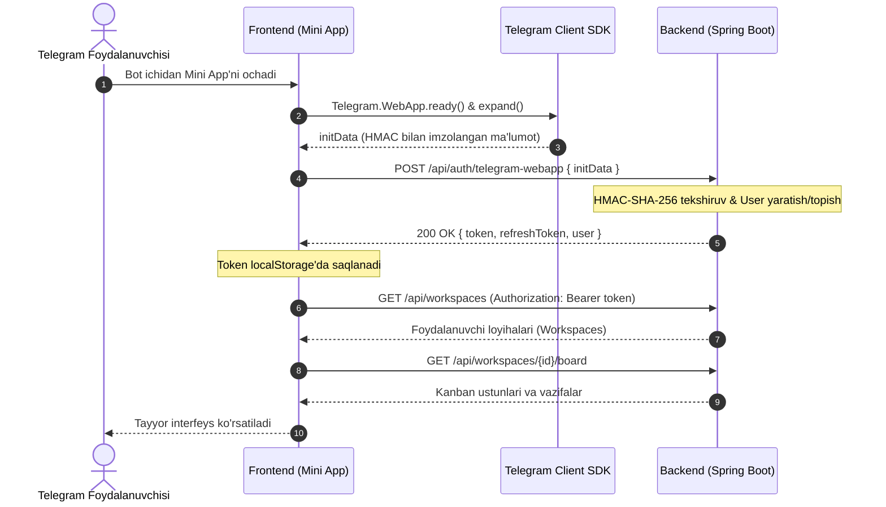

# 🚀 Telegram Mini App (TMA) — Frontend Dasturchi Qo'llanmasi
**TaskCenter Kanban Board — Telegram Mini App Integratsiyasi**

Ushbu qo'llanma Frontend dasturchiga **TaskCenter** tizimining Telegram Mini App (TMA) qismini noldan boshlab, eng oson va tezkor usulda backendga ulash uchun tayyorlandi.

---

## 📌 1. Arxitektura va Kirish (Zero-Click Login)

Telegram Mini App'ning eng katta ustunligi — **foydalanuvchidan login yoki parol so'ralmaydi**.
Telegram o'zi xavfsiz imzolangan `initData` ma'lumotlar satrini beradi. Frontend ushbu satrni backendga yuboradi va evaziga standart **JWT Bearer Token** oladi. Keyingi barcha so'rovlar shu token bilan oddiy API kabi amalga oshiriladi.



---

## 🛠 2. Telegram WebApp SDK ni ulash

### Variant A: HTML orqali (Vite / React / Vue / Vanilla)
`index.html` faylining `<head>` qismiga quyidagi rasmiy skriptni qo'shing:

```html
<script src="https://telegram.org/js/telegram-web-app.js"></script>
```

### Variant B: NPM kutubxona (TypeScript / React)
```bash
npm install @telegram-apps/sdk-react
# yoki
npm install @tma.js/sdk
```

Ilova ishga tushganda quyidagilarni chaqirish tavsiya etiladi:
```javascript
// Ilova yuklangach darhol chaqiring:
window.Telegram.WebApp.ready();
window.Telegram.WebApp.expand(); // Mini App'ni butun ekranga ochish
```

---

## 🔐 3. Avtorizatsiya: `initData` orqali JWT Token olish

Frontend ilova ochilishi bilan quyidagi so'rovni yuborib JWT tokenini oladi:

- **URL:** `POST /api/auth/telegram-webapp`
- **Headers:** `Content-Type: application/json`
- **Request Body:**
```json
{
  "initData": "query_id=AAHdF...&user=%7B%22id%22%3A12345...%7D&auth_date=1710000000&hash=d824..."
}
```

> **Eslatma:** `window.Telegram.WebApp.initData` — bu Telegram tomonidan taqdim etiladigan tayyor string.

- **Response:**
```json
{
  "success": true,
  "message": "Telegram orqali tizimga muvaffaqiyatli kirdingiz",
  "data": {
    "token": "eyJhbGciOiJIUzI1NiIsInR5cCI6IkpXVCJ9...",
    "refreshToken": "48b6fa20-435d-4f11-...",
    "user": {
      "id": "c1f7a08b-...",
      "name": "bekmurod_dev",
      "fullName": "Bekmurod",
      "role": "USER"
    }
  }
}
```

Olingan `token` keyingi barcha so'rovlarda quyidagicha yuboriladi:
`Authorization: Bearer eyJhbGciOi...`

---

## 📋 4. Asosiy API Endpoints (CRUD)

Barcha endpointlar uchun `Authorization: Bearer <token>` sarlavhasi (header) talab qilinadi.

### 1. Foydalanuvchi Workspace'larini olish
- **Endpoint:** `GET /api/workspaces`
- **Query Parametrlari:** `page=0&size=20` (ixtiyoriy)
- **Response:**
```json
{
  "success": true,
  "data": {
    "content": [
      {
        "id": "ws-12345",
        "name": "Backend Rivojlanish",
        "description": "Asosiy loyiha",
        "isOwner": true,
        "memberCount": 5
      }
    ],
    "totalElements": 1,
    "totalPages": 1
  }
}
```

---

### 2. Kanban Doskasini olish (Ustunlar va Vazifalar)
Birgina so'rov orqali tanlangan loyihadagi barcha ustunlar (masalan: *To Do*, *In Progress*, *Done*) va ularning ichidagi barcha vazifalar kartochkalari olinadi!

- **Endpoint:** `GET /api/workspaces/{workspaceId}/board`
- **Response:**
```json
{
  "success": true,
  "data": [
    {
      "id": "col-todo-uuid",
      "title": "To Do",
      "order": 0,
      "cards": [
        {
          "id": "task-uuid-1",
          "publicId": "TASK-101",
          "title": "Telegram WebApp UI dizayni",
          "priority": "HIGH",
          "dueDate": "2026-10-15",
          "labels": [{ "name": "Frontend", "color": "#3B82F6" }],
          "assignees": [{ "id": "...", "name": "bekmurod", "fullName": "Bekmurod" }]
        }
      ]
    },
    {
      "id": "col-inprogress-uuid",
      "title": "In Progress",
      "order": 1,
      "cards": []
    },
    {
      "id": "col-done-uuid",
      "title": "Done",
      "order": 2,
      "cards": []
    }
  ]
}
```

---

### 3. Yangi Vazifa Yaratish
- **Endpoint:** `POST /api/workspaces/{workspaceId}/tasks`
- **Request Body:**
```json
{
  "columnId": "col-todo-uuid",
  "title": "Mini App orqali bildirishnomalarni ulash",
  "description": "Foydalanuvchi interfeysini sozlash",
  "priority": "HIGH",
  "dueDate": "2026-10-20"
}
```
> *Muhim:* `priority` qiymatlari: `LOW`, `MEDIUM`, `HIGH`, `URGENT`.  
> `dueDate` formati: `YYYY-MM-DD`.

---

### 4. Vazifani Boshqa Ustunga Ko'chirish (Drag-and-Drop yoki Status o'zgartirish)
- **Endpoint:** `PATCH /api/workspaces/{workspaceId}/tasks/{taskId}`
- **Request Body:**
```json
{
  "columnId": "col-inprogress-uuid"
}
```
Agar sarlavha yoki tavsif ham o'zgartirilsa, shu body ichida birga yuborilishi mumkin:
```json
{
  "columnId": "col-done-uuid",
  "title": "Yangi yangilangan nom"
}
```

---

### 5. Vazifani O'chirish
- **Endpoint:** `DELETE /api/workspaces/{workspaceId}/tasks/{taskId}`
- **Response:**
```json
{
  "success": true,
  "message": "Bosh og'riq o'chirildi",
  "data": null
}
```

---

## 🎨 5. Telegram Native UI Imkoniyatlaridan Foydalanish

Telegram Mini App ilovangiz Telegramning o'zining bir qismidek tabiiy ko'rinishi uchun quyidagi imkoniyatlarni qo'llang:

### 1. Telegram Dark/Light rejimiga moslashuvchi ranglar
Telegram CSS parametrlarini taqdim etadi. Ilovangiz stilini quyidagilarga bog'lang:
```css
body {
  background-color: var(--tg-theme-bg-color, #ffffff);
  color: var(--tg-theme-text-color, #000000);
}

.button-primary {
  background-color: var(--tg-theme-button-color, #2481cc);
  color: var(--tg-theme-button-text-color, #ffffff);
}

.secondary-card {
  background-color: var(--tg-theme-secondary-bg-color, #f4f4f5);
}
```

### 2. MainButton (Pastki asosiy tugma)
Telegram oynasining pastida yopishib turuvchi asosiy tugma:
```javascript
const mainBtn = window.Telegram.WebApp.MainButton;

// Tugmani sozlash va ko'rsatish:
mainBtn.setText("➕ YANGI VAZIFA");
mainBtn.show();
mainBtn.onClick(() => {
  openCreateTaskModal();
});
```

### 3. Haptic Feedback (Vibratsiya effektlari)
Foydalanuvchi tugmani bosganda yoki kartochkani boshqa ustunga surib tashlaganda yoqimli vibratsiya berish:
```javascript
const haptic = window.Telegram.WebApp.HapticFeedback;

// Oddiy tugma bosilishi:
haptic.impactOccurred('light'); // 'light' | 'medium' | 'heavy'

// Muvaffaqiyatli amal bajarilganda:
haptic.notificationOccurred('success'); // 'success' | 'warning' | 'error'
```

### 4. BackButton (Tepada orqaga qaytish tugmasi)
Mini App ichida bitta sahifadan (masalan vazifa batafsil sahifasidan) orqaga qaytish uchun:
```javascript
const backBtn = window.Telegram.WebApp.BackButton;

backBtn.show();
backBtn.onClick(() => {
  router.back(); // yoki o'zingizning orqaga funksiyangiz
  backBtn.hide();
});
```

---

## 💻 6. Frontend Dasturchi Uchun Tayyor Kod (Axios + Auto Auth)

Quyidagi faylni loyihangizga `src/api.js` sifatida nusxalab oling:

```javascript
import axios from 'axios';

const API_BASE_URL = 'http://localhost:8080'; // Yoki sizning backend server manzilingiz

export const api = axios.create({
  baseURL: API_BASE_URL,
  headers: {
    'Content-Type': 'application/json'
  }
});

// So'rovlarga avtomatik Authorization token qo'shish
api.interceptors.request.use((config) => {
  const token = localStorage.getItem('tc_token');
  if (token) {
    config.headers.Authorization = `Bearer ${token}`;
  }
  return config;
});

/**
 * Telegram initData orqali avtomatik tizimga kirish
 */
export async function authenticateTelegram() {
  const tg = window.Telegram?.WebApp;
  const initData = tg?.initData;

  if (!initData) {
    console.warn("Telegram WebApp muhiti aniqlanmadi (Brauzerda test rejimi)");
    // Agar lokal brauzerda test qilinayotgan bo'lsa:
    return null;
  }

  try {
    const res = await api.post('/api/auth/telegram-webapp', { initData });
    const { token, refreshToken, user } = res.data.data;
    
    localStorage.setItem('tc_token', token);
    localStorage.setItem('tc_refresh_token', refreshToken);
    localStorage.setItem('tc_user', JSON.stringify(user));
    
    return user;
  } catch (error) {
    console.error("Telegram WebApp orqali kirishda xatolik:", error);
    throw error;
  }
}

/**
 * Loyihalarni olish
 */
export async function getWorkspaces() {
  const res = await api.get('/api/workspaces');
  return res.data.data.content;
}

/**
 * Tanlangan loyihaning Kanban doskasini olish
 */
export async function getBoard(workspaceId) {
  const res = await api.get(`/api/workspaces/${workspaceId}/board`);
  return res.data.data;
}

/**
 * Yangi vazifa yaratish
 */
export async function createTask(workspaceId, taskData) {
  const res = await api.post(`/api/workspaces/${workspaceId}/tasks`, taskData);
  return res.data.data;
}

/**
 * Vazifani ustunini o'zgartirish (Status/Move)
 */
export async function moveTask(workspaceId, taskId, columnId) {
  const res = await api.patch(`/api/workspaces/${workspaceId}/tasks/${taskId}`, { columnId });
  return res.data.data;
}
```

---

## 🤖 7. BotFather'da Mini App Sozlash

Frontend ilovangizni tayyorlab (masalan `Vercel`, `Netlify` yoki `ngrok` orqali) serverga chiqarganingizdan so'ng:

1. Telegramda **@BotFather** botiga kiring.
2. `/mybots` buyrug'ini yuboring va botingizni tanlang.
3. **Bot Settings** ➡️ **Menu Button** ➡️ **Configure menu button** ni bosing.
4. Mini App havolasini yuboring (masalan: `https://my-task-app.vercel.app`).
5. Menyudagi tugma nomini kiriting: `📋 Task Doska`.
6. Bo'ldi! Endi bot ichida chap pastki burchakda **"📋 Task Doska"** tugmasi paydo bo'ladi va uni bosganda dastur ochiladi!

---

## 💡 Xulosa va Maslahatlar

1. **Lokal testlash:** Mahalliy kompyuterda ishlayotganda `ngrok http 5173` yordamida vaqtinchalik `https://...ngrok-free.app` URL olib, Telegram WebApp'da bemalol sinab ko'rishingiz mumkin.
2. **Keshdan saqlanish:** Telegram WebApp ba'zida brauzer keshini ushlab qolishi mumkin. Versiyani o'zgartirib turish uchun index html havolasiga `?v=1.0.1` qo'shib yuborish foydali.
3. **Savollar bormi?** Swagger hujjati barcha backend metodlari bilan mavjud: `/swagger-ui.html`.
