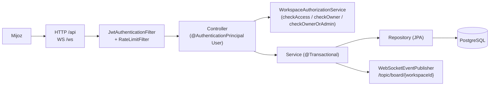

# 01. Umumiy ko'rinish

## Bu nima

Task Center Backend - jamoalar uchun Jira uslubidagi task boshqaruv API.
Hamma ish workspace ichida tashkil qilinadi: har bir workspace'da tartibli
column'lardan iborat board va ularning ichida tasklar bo'ladi. Taskda
ustuvorlik, due date, biriktirilgan user va labellar bo'lishi mumkin, har
biri `TC-1` ko'rinishidagi qisqa public ID bilan topiladi.

## Asosiy tushunchalar

- **User** - `USER` yoki `ADMIN` rolli akkaunt, JWT bilan kiradi.
- **Workspace** - eng yuqori konteyner. Bitta egasi bor, a'zolar bilan ulashiladi
  (`OWNER` / `ADMIN` / `MEMBER`). Har birida qisqa unikal `keyPrefix` bor (masalan `WR`).
- **Board** - bazada saqlanmaydi: workspace column'lari va card'larini birlashtirgan
  o'qish view'i (`GET /api/workspaces/{id}/board`).
- **Column** - board'dagi tartibli yo'lak (`To Do`, `Done` ...).
- **Task** - ish birligi. `<PREFIX>-<counter>` ko'rinishidagi `publicId` bilan
  topiladi (masalan `TC-6`).
- **Label** - workspace ichidagi nomli rangli teg, tasklarga yopishtiriladi.

## Texnologiyalar

Java 17, Spring Boot 3.2.5 (Web, Data JPA, Security, Validation, Cache, Actuator),
PostgreSQL, Flyway 10.13, JWT (`jjwt 0.11.5`), WebSocket/STOMP, Caffeine kesh,
Bucket4j rate limiting, Micrometer/Prometheus, JUnit 5 + Mockito + MockMvc,
springdoc-openapi 2.5.0, Maven wrapper.

## Nimalar bor

- BCrypt parollar va 7 kunlik JWT bilan register/login.
- Workspace CRUD, a'zolik boshqaruvi va har operatsiyada rol tekshiruvi.
- Column CRUD va alohida reorder endpoint'i.
- Avto-nomerlanadigan public ID bilan Task CRUD (parallel yozuvda pessimistic lock),
  task ko'chirish, biriktirish, labellar.
- STOMP orqali real-time board eventlar (`TASK_CREATED`, `TASK_UPDATED` ...).
- Hamma asosiy entity'da soft delete, sxema Flyway'da (V1-V10).
- User statistikasi (`GET /api/me/stats`).

## So'rov qanday o'tadi

