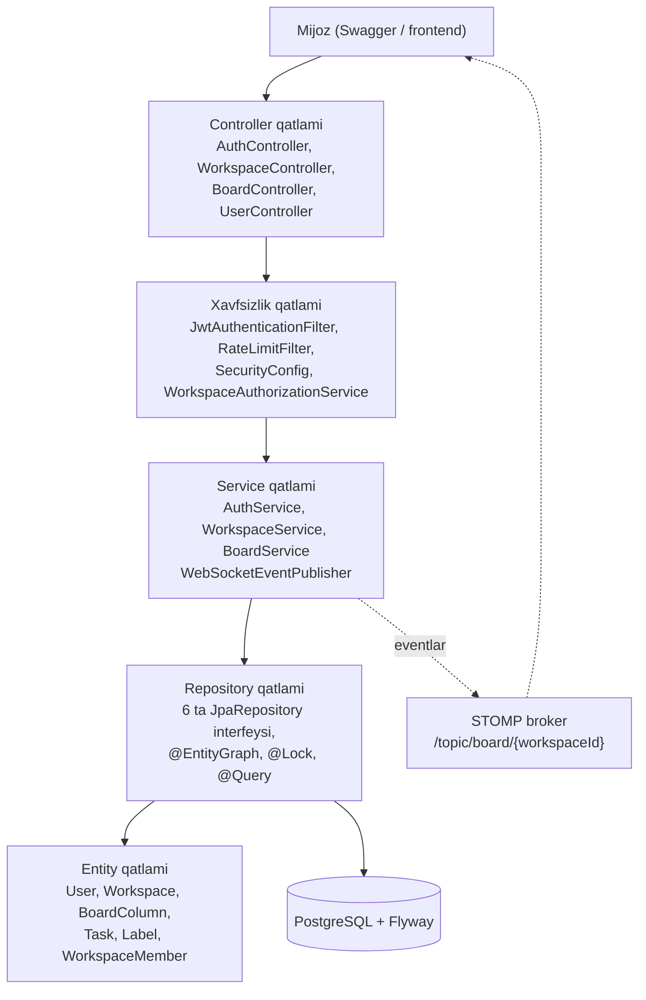

# 02. Arxitektura

Qatlamli monolit (`com.taskcenter`). Controller'lar yupqa, butun tranzaksiya va
avtorizatsiya servislar zimmasida, repository'lar Spring Data JPA interfeyslari,
har bir javob DTO'ga map qilinadi. MapStruct va query DSL ishlatilmaydi.

## Qatlamlar nima qiladi

| Qatlam | Paket | Mas'uliyat |
|---|---|---|
| Controller | `controller` | HTTP mapping, `@Valid` body'lar, `@AuthenticationPrincipal User`, natijani `ApiResponse` ga o'rash. Biznes logika bu yerda bo'lmaydi. |
| Service | `service` | Tranzaksiyalar (`BoardService` class darajasida `@Transactional`), `WorkspaceAuthorizationService` orqali ruxsat tekshiruvi, counter oshirish, DTO mapping (`*Dto.fromEntity`), WebSocket publish. |
| Avtorizatsiya | `service.WorkspaceAuthorizationService` | `checkAccess` / `checkOwner` / `checkOwnerOrAdmin` va rol so'rovlari bitta joyda. Ruxsat bo'lmasa `ForbiddenException` (403), workspace topilmasa `EntityNotFoundException` (404) tashlaydi. |
| Repository | `repository` | 6 ta `JpaRepository` interfeysi, derived va `@Query` metodlar, bitta pessimistic lock (`findByIdForUpdate`), `@EntityGraph` fetch planlar. |
| Entity | `model` | JPA mappinglar, UUID id'lar (`prePersist`), soft delete (`@SQLDelete` + `@Where`), audit ustunlari. |
| DTO | `dto` | So'rov validatsiyasi (`RegisterRequest`, `TaskCreateRequest` ...) va javob shakllari (`fromEntity` fabrikalar bilan). |
| Xavfsizlik | `security`, `config.SecurityConfig` | Stateless JWT filtr zanjiri, BCrypt encoder, CORS, o'chirilgan CSRF, rate-limit filtr tartibi. |
| Xatolar | `controller.GlobalExceptionHandler` | Exception'larni `ApiResponse.error` va HTTP statuslarga o'giradigan `@RestControllerAdvice`. |
| WebSocket | `config` + `service.WebSocketEventPublisher` | STOMP broker config, JWT handshake va subscription interceptorlar, `BoardEvent` broadcast. |
| Infratuzilma | `config`, `monitoring` | Caffeine kesh, Bucket4j bean'lar, JPA auditing, Swagger, seed data, health indicator, request logging. |
