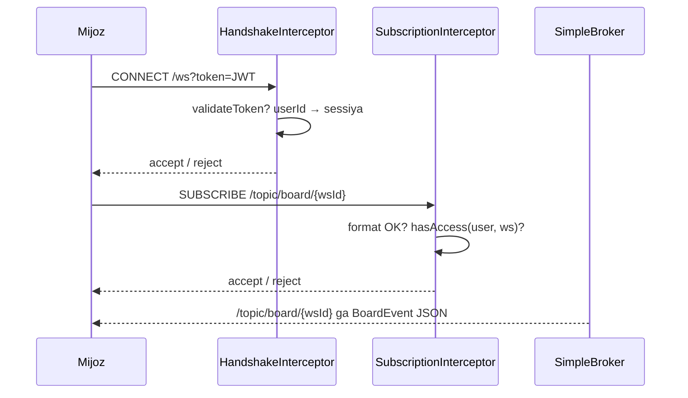

# 13. WebSocket / STOMP

`WebSocketConfig` (`@EnableWebSocketMessageBroker`): SockJS'li `/ws` endpoint,
`/topic` da oddiy in-memory broker, application prefiksi `/app`.

## Ulanish

```
STOMP CONNECT to ws(s)://<host>/ws?token=<JWT>      # brauzer header qo'ya olmaydi, shuning uchun query param
# yoki header:  Authorization: Bearer <token>
SUBSCRIBE /topic/board/{workspaceId}
```

`WebSocketAuthInterceptor` handshake'da tokenni tekshiradi. `validateToken`
o'tmasa handshake rad etiladi (`false` qaytadi). User id (`getUserIdFromToken`
dagi `id` claim) sessiya atributlariga yoziladi.

## Obuna himoyasi

`SubscriptionAuthorizationInterceptor.preSend` har `SUBSCRIBE` da ishlaydi va
faqat `/topic/board/` bilan boshlanuvchilarni tekshiradi. Suffiks workspace id
bo'ladi: bo'sh yoki `/` yoxud `.` saqlagan id'lar (masalan
`/topic/board/../admin`) darhol rad etiladi. Qolgan holda sessiyadagi `userId`
`hasAccess(workspaceId, userId)` dan o'tishi shart (owner/admin/member), aks
holda `IllegalArgumentException` chiqadi. Tekshiruvdan o'tmagan obuna rad etiladi.



## Qanday eventlar chiqadi

`BoardService` muvaffaqiyatli yozuvlardan keyin
`WebSocketEventPublisher.publishBoardEvent(workspaceId, event)` ni chaqiradi.
`BoardEvent{type, data}` Jackson bilan JSON'lanib `/topic/board/{workspaceId}` ga
yuboriladi.

| Tip | Payload | Qaysi metoddan |
|---|---|---|
| `TASK_CREATED` | `TaskDto` | `createTask` |
| `TASK_UPDATED` | `TaskDto` | `updateTask` |
| `TASK_DELETED` | `TaskDto` (o'chirishdan oldingi holat) | `deleteTask` |
| `COLUMN_CREATED` / `COLUMN_UPDATED` | `ColumnDto` | `create/update/patchColumn` |
| `COLUMN_DELETED` | `ColumnDto` (o'chirishdan oldingi holat) | `deleteColumn` |
| `LABEL_CREATED` / `LABEL_DELETED` | `LabelDto` | `create/deleteLabel` |

Bular chiqmaydi (oddiy save): task column ko'chirish (`updateTaskColumn`),
assignee o'zgarishi, label qo'shish/olib tashlash, column reorder. Event'da sender
id yo'q, shuning uchun mijoz o'z optimistic update'ini lokal filtrlaydi.
