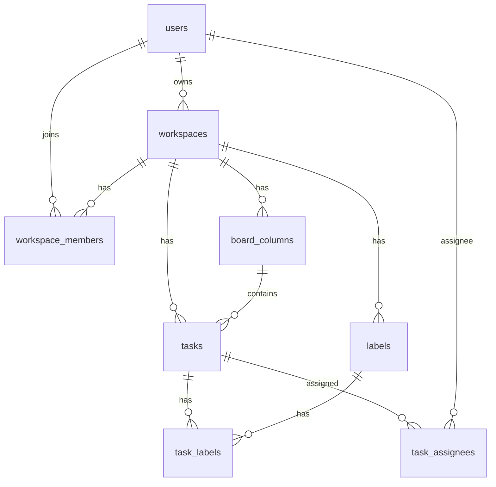

# 14. Baza

PostgreSQL (lokalda `docker-compose` dagi `postgres:16`, Render'da PostgreSQL 18.
Render'dagi versiyada Flyway "test qilinmagan versiya" ogohlantirishi beradi, lekin
ishlaydi). Hamma id `VARCHAR(255)` UUID (`prePersist` da generatsiya). Flyway
tarix V1 dan V10 gacha, barchasi idempotent (`IF NOT EXISTS`).

## Jadvallar

| Jadval | Asosiy ustunlar | Izoh |
|---|---|---|
| `users` | `id` PK, `name`/`email` unique, `role` CHECK (`USER`,`ADMIN`), audit + `deleted_at` | BCrypt parol, hech qachon serialize qilinmaydi |
| `workspaces` | `id` PK, `owner_id` FK→users, `key_prefix VARCHAR(10) NOT NULL DEFAULT 'WS'`, `task_counter INT NOT NULL DEFAULT 0`, audit + `deleted_at` | aktiv qatorlar uchun partial unique index |
| `board_columns` | `id` PK, `workspace_id` FK CASCADE, `title`, `column_order`, `is_default`, audit + `deleted_at` | ustiga ishlatilmaydigan V6 `version BIGINT` |
| `tasks` | `id` PK, `public_id` UNIQUE, `workspace_id`/`column_id` FK CASCADE, `title`, `description` TEXT, `task_order`, `priority`, `assignee_id` (oddiy id, FK emas), `due_date`, audit + `deleted_at` | label/assignee join orqali |
| `labels` | `id` PK, `workspace_id` FK CASCADE, `name`, `color`, audit + `deleted_at` | ustiga ishlatilmaydigan `version` |
| `task_labels` | composite PK (`task_id`,`label_id`), ikkala FK CASCADE | M-N task va label |
| `task_assignees` | composite PK (`task_id`,`user_id`), ikkala FK CASCADE | M-N task va user |
| `workspace_members` | composite PK (`workspace_id`,`user_id`) + unique juftlik, `role`, FK CASCADE, soft delete yo'q | a'zolik + workspace roli |

## Migratsiyalar

| Versiya | Tarkib |
|---|---|
| V1 | To'liq baseline sxema, FK'lar va performance indexlar (`idx_tasks_public_id` unique) |
| V2 | Yetim qatorlarni tozalash |
| V3 | FK ustun indexlari |
| V4 | Hamma FK `ON DELETE CASCADE` ga qayta qurilgan |
| V5 | `created_by`/`updated_by`/`deleted_at` (timestamp'lar bilan) va `deleted_at` indexlari |
| V6 | tasks/columns/workspaces/labels da `version BIGINT` (optimistic-lock niyati edi, entity'larda `@Version` yo'q, hozircha ishlatilmaydi) |
| V7 | workspace'larda `key_prefix` + `task_counter`, mavjudlar title'dan backfill qilingan |
| V8 | Dublikat `key_prefix` avto-tozalash (`WR` dan `WR2` ...), keyin full unique constraint |
| V9 | task'larda `priority`/`assignee_id`/`due_date` (V6 fayl nomi to'qnashuvidan keyin ko'chirilgan) |
| V10 | V8 constraint o'rniga partial unique index `WHERE deleted_at IS NULL` |

Bitta tarixiy sabab: `spring.flyway.validate-on-migrate` hozir `false`, chunki
prod'ga bir marta qo'lda boshqa checksum'li `V6` applied qilingan edi. U yerda
`flyway repair` qilingach `true` ga qaytarish mumkin.

## ER diagramma

