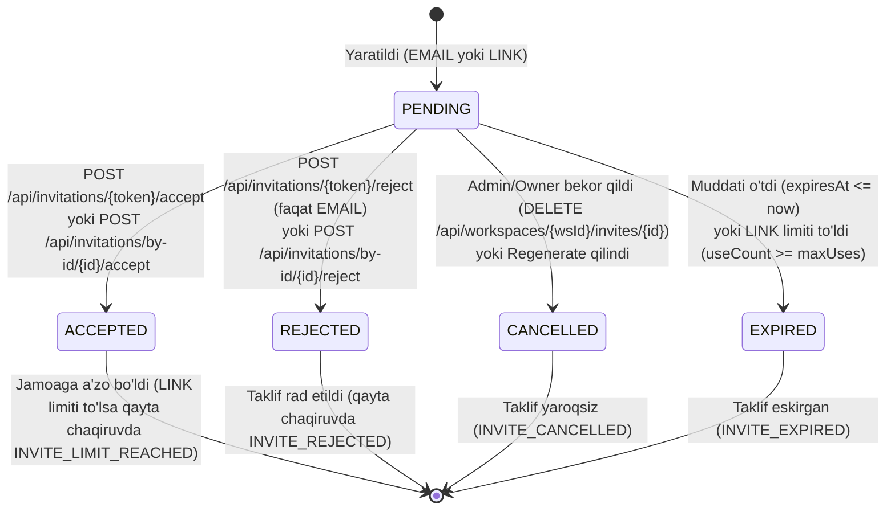

# Task Center — Workspace Takliflar Tizimi (Frontend Integratsiya Hujjati)

Ushbu hujjat frontend dasturchilar uchun Task Center ishchi maydon (workspace) taklif tizimini hech qanday savollarsiz va oson ulash uchun mo'ljallangan. Barcha misollar haqiqiy integratsion testlardan (`target/contract-examples/*.json`) olingan.

---

## ⚠️ O'zgarishlar (Breaking Changes)

Backend arxitekturasida quyidagi muhim o'zgarishlar amalga oshirilgan bo'lib, Frontend ishlab chiquvchilari ularni inobatga olishlari shart:

1. **Autentifikatsiya xatolari: 403 emas, endi 401 (`UNAUTHORIZED` / `TOKEN_EXPIRED`)**
   - Ilgari: So'rovda Authorization header bo'lmaganda yoki noto'g'ri/muddati o'tgan JWT yuborilganda ba'zan 403 Forbidden qaytarilar edi.
   - Hozir: Tokensiz yoki yaroqsiz token bilan kelgan so'rovlar qat'iy ravishda **401 Unauthorized** qaytaradi (`errorCode: "UNAUTHORIZED"`). Token muddati tugagan bo'lsa, **401 Unauthorized** (`errorCode: "TOKEN_EXPIRED"`). 403 faqat foydalanuvchi tizimga kirgan, lekin tegishli resursga huquqi yetarli bo'lmaganda (`FORBIDDEN`, `FORBIDDEN_ROLE`, `INVITE_EMAIL_MISMATCH`) qaytadi.

2. **Sana formatlari: UTC 'Z' formati va eski endpointlar ro'yxati**
   - **'Z' bilan tugaydigan yangi ISO-8601 UTC sanalar:**
     - Barcha API javoblarining umumiy wrapperidagi `ApiResponse.timestamp` (masalan: `"2026-10-10T16:00:27.500557800Z"`).
     - Barcha taklif DTO lari: `WorkspaceInvitationDto.createdAt`, `WorkspaceInvitationDto.expiresAt`, hamda `PublicInvitationDto.expiresAt`.
   - **Eski formatda qolgan endpointlar (orqaga muvofiqlik uchun 'Z' qo'shilmagan, `LocalDateTime`):**
     - `/api/tasks/**` (`TaskDto`, `TaskCardDto`, `TaskActivityDto`, `TaskCommentDto` — `createdAt`, `updatedAt`, `dueDate`)
     - `/api/workspaces/**` (`WorkspaceDto` — `createdAt`)
     - `/api/chat/**` (`ChatMessageDto` — `createdAt`)
     - `/api/notifications/**` (`NotificationDto` — `createdAt`)
     - `/api/users/**` (`UserDto` — `createdAt`)
     - Ushbu eski DTO lardagi sanalar standart `LocalDateTime` ko'rinishida (masalan: `"2026-10-10T21:00:00"`) qaytadi. Frontend parserlari ikkala formatni ham to'g'ri qabul qila olishi kerak.

3. **CORS defaulti bo'sh — `CORS_ALLOWED_ORIGINS` majburiy**
   - Standart holatda backendda hech qanday frontend domeni ochiq qoldirilmagan (default: `[]`).
   - Production muhitda frontend domenlari ishlashi uchun serverda `CORS_ALLOWED_ORIGINS` muhit o'zgaruvchisi aniq ko'rsatilishi shart (masalan: `CORS_ALLOWED_ORIGINS=https://app.taskcenter.com,https://tma.taskcenter.com`). Bo'sh qoldirilsa, brauzer CORS preflight so'rovlarini bloklaydi. Localhost esa faqat `dev` profilida ishlaydi.

---

## 1. Taklif Holatlari Diagrammasi (State Machine)

Taklifnoma o'z hayotiy tsikli davomida quyidagi holatlardan o'tadi:



### Holat o'tishlarining sabablari va endpointlari:

| Boshlang'ich holat | Yakuniy holat | Amal / Endpoint | Sabab / Shart |
| :--- | :--- | :--- | :--- |
| *(Yangi)* | `PENDING` | `POST /api/workspaces/{wsId}/invites` yoki `POST /api/workspaces/{wsId}/invites/link` | Admin yoki Owner yangi taklif yaratdi. |
| `PENDING` | `ACCEPTED` | `POST /api/invitations/{token}/accept` yoki `POST /api/invitations/by-id/{id}/accept` | Taklif qilingan foydalanuvchi taklifni qabul qildi va a'zo bo'ldi. |
| `PENDING` | `REJECTED` | `POST /api/invitations/{token}/reject` yoki `POST /api/invitations/by-id/{id}/reject` | Foydalanuvchi taklifni rad etdi. **Diqqat:** LINK taklifda bitta user rad etishi umumiy havolani buzmaydi; faqat EMAIL taklifda status `REJECTED` bo'ladi. Rad etilgan taklifni qayta qabul qilishga urinilsa `INVITE_REJECTED` qaytadi. |
| `PENDING` | `CANCELLED` | `DELETE /api/workspaces/{wsId}/invites/{id}` yoki `POST /api/workspaces/{wsId}/invites/link/regenerate` | Admin taklifni o'chirdi yoki havola qayta generatsiya qilinganda eski havolalar bekor qilindi. |
| `PENDING` | `EXPIRED` | Avtomatik (vaqt o'tishi yoki `useCount >= maxUses`) | Taklifning muddati tugadi (`expiresAt`) yoki havoladan ruxsat etilgan maksimal foydalanuvchilar soni to'ldi. |

---

## 2. EMAIL va LINK Takliflari Farqi

| Xususiyat | EMAIL Taklif (`type: "EMAIL"`) | LINK Taklif (`type: "LINK"`) |
| :--- | :--- | :--- |
| **Kim qabul qila oladi?** | Faqat taklif yuborilgan aniq email egasi (`receiverEmail` bilan tizimga kirgan user). | Tizimga kirgan istalgan foydalanuvchi. |
| **Reject (rad etish) nima qiladi?** | Taklif statusi `REJECTED` bo'ladi, taklif yopiladi va qayta qabul qilib bo'lmaydi (`INVITE_REJECTED`). | Umumiy havola buzilmaydi, boshqa foydalanuvchilar undan foydalana oladi. |
| **Token qachon ko'rinadi?** | Faqat yaratilganda (`POST .../invites`) yoki qayta yuborilganda (`POST .../resend`). Ro'yxatlarda xavfsizlik uchun `null`. | Faqat yaratilganda yoki qayta yangilanganda (`POST .../regenerate`). Ro'yxatda `null`. |
| **`by-id` endpointi ishlaydimi?** | **HA** (`POST /api/invitations/by-id/{id}/accept`). | **YO'Q** (400 `INVALID_INVITE_TYPE` qaytaradi). Havolalar faqat token orqali qabul qilinadi. |
| **Foydalanish soni (`maxUses`)** | Har doim 1 marta. | Admin tomonidan belgilanadi (masalan, 10, 50 yoki `null` — cheksiz). Limiti to'lganda `INVITE_LIMIT_REACHED` qaytadi. |
| **Email yetkazish holati** | Brevo orqali jo'natiladi (`SENT`, `FAILED`, `PENDING`). | Har doim `NOT_APPLICABLE`. |
| **`receiverId` / `receiverEmail`** | Ma'lum bo'lsa to'ldiriladi, yangi foydalanuvchida `receiverId: null`. | Har doim `null`. |

---

## 2.1. Maydonlarning Null Bo'lishi Jadvali (Nullability Table)

Frontend modellarida maydonlarni aniq tiplashtirish (masalan, TypeScript `?` yoki `null`) uchun quyidagi jadvalga qat'iy amal qiling:

### 1. `WorkspaceInvitationDto` (Admin va /me javoblarida)

| Maydon nomi | Turi | Nullable? | Qachon `null` bo'ladi va qachon to'ldiriladi? |
| :--- | :--- | :---: | :--- |
| `id` | `string` (UUID) | **YO'Q** | Har doim to'liq identifikator mavjud. |
| `workspaceId` | `string` (UUID) | **YO'Q** | Ish maydoni identifikatori. |
| `senderId` | `string` (UUID) | **YO'Q** | Taklif yuborgan foydalanuvchi identifikatori. |
| `receiverId` | `string` (UUID) | **HA** | LINK takliflarida har doim `null`. EMAIL taklifida qabul qiluvchi hali ro'yxatdan o'tmagan bo'lsa `null`; u qabul qilgach to'ldiriladi. |
| `receiverEmail` | `string` | **HA** | Faqat EMAIL takliflarida to'ldiriladi. LINK turidagi umumiy havolalarda har doim `null`. |
| `role` | `string` (Enum) | **YO'Q** | Taklif etilgan rol (`OWNER`, `ADMIN`, `MEMBER`, `VIEWER`). |
| `status` | `string` (Enum) | **YO'Q** | `PENDING`, `ACCEPTED`, `REJECTED`, `CANCELLED`, `EXPIRED`. |
| `createdAt` | `string` (ISO-8601 UTC) | **YO'Q** | Har doim UTC 'Z' bilan tugaydi (masalan: `2026-10-10T16:00:27.478813300Z`). |
| `expiresAt` | `string` (ISO-8601 UTC) | **HA** | Muddatsiz LINK larda `null` bo'lishi mumkin. Aks holda har doim 'Z' bilan tugaydigan sana. |
| `workspaceTitle` | `string` | **YO'Q** | Ish maydoni nomi. |
| `senderName` | `string` | **HA** | Agar taklif yuboruvchining to'liq ismi yoki username'i kiritilmagan bo'lsa `null`. |
| `type` | `string` (Enum) | **YO'Q** | `EMAIL` yoki `LINK`. |
| `token` | `string` | **HA** | **Faqat taklif yaratilgan yoki regenerate qilingan paytda to'ldiriladi.** Ro'yxatlarda (`GET /me`, `GET .../invites`) xavfsizlik tufayli har doim `null`. |
| `maxUses` | `number` | **HA** | EMAIL turida 1; cheksiz LINK turida `null`; cheklangan LINK turida butun son (masalan, `10`). |
| `useCount` | `number` | **YO'Q** | Havoladan foydalanilganlar soni (boshlang'ich qiymati `0`). |
| `emailDeliveryStatus`| `string` (Enum) | **YO'Q** | EMAIL taklifida `PENDING`, `SENT`, `FAILED`, `SKIPPED`. LINK taklifida har doim `NOT_APPLICABLE`. |
| `emailDeliveryError` | `string` | **HA** | Faqat jo'natish xatolikka uchraganda xato matni; muvaffaqiyatli jo'natilganda yoki LINK da `null`. |
| `telegramInviteLink` | `string` | **HA** | Faqat yangi yaratilganda (token mavjud bo'lganda) to'ldiriladi, ro'yxatlarda `null`. |
| `telegramMiniappLink`| `string` | **HA** | Faqat yangi yaratilganda (token mavjud bo'lganda) to'ldiriladi, ro'yxatlarda `null`. |
| `inviteLink` | `string` | **HA** | Faqat yangi yaratilganda (token mavjud bo'lganda) to'ldiriladi, ro'yxatlarda `null`. |

### 2. `PublicInvitationDto` (`GET /api/invitations/{token}`)

| Maydon nomi | Turi | Nullable? | Tavsif |
| :--- | :--- | :---: | :--- |
| `workspaceTitle` | `string` | **YO'Q** | Ishchi maydon nomi. |
| `inviterName` | `string` | **HA** | Taklif qiluvchi shaxsning ismi (bo'lmasa `null`). |
| `role` | `string` (Enum) | **YO'Q** | Taklif etilayotgan rol (`MEMBER`, `ADMIN`, ...). |
| `type` | `string` (Enum) | **YO'Q** | `EMAIL` yoki `LINK`. |
| `expiresAt` | `string` (ISO-8601 UTC) | **HA** | Havola muddatsiz bo'lsa `null`, aks holda har doim 'Z' bilan tugaydi. |
| `expired` | `boolean` | **YO'Q** | Amal qilish muddati tugaganmi yoki limit to'lganmi (`true`/`false`). |

---

## 3. Integratsiya Oqimlari (Flows)

Barcha sana formatlari **ISO-8601 (UTC)** bo'lib, har doim `'Z'` harfi bilan tugaydi (masalan: `2026-10-10T16:00:27.500557800Z`). Barcha ID lar **UUID** formatida.

### Oqim A: Tizimga kirgan foydalanuvchi havola ochadi

1. **Sahifa ochilganda taklif ma'lumotlarini olish (Public Preview):**
   - **So'rov:**
     ```http
     GET /api/invitations/pP3aK_91xL-w7Q3zD5eFg8hIjKlMnOpQrStUvWxYz01 HTTP/1.1
     Host: api.taskcenter.com
     ```
   - **Haqiqiy javob (200 OK — `target/contract-examples/public_preview_success.json`):**
     ```json
     {
       "success" : true,
       "message" : "ok",
       "data" : {
         "workspaceTitle" : "Contract Workspace",
         "inviterName" : "Contract Admin",
         "role" : "MEMBER",
         "type" : "LINK",
         "expiresAt" : "2026-10-15T15:57:20.092406200Z",
         "expired" : false
       },
       "timestamp" : "2026-10-10T15:57:20.132485200Z"
     }
     ```

2. **Foydalanuvchi "Jamoaga qo'shilish" tugmasini bosganda:**
   - **So'rov:**
     ```http
     POST /api/invitations/pP3aK_91xL-w7Q3zD5eFg8hIjKlMnOpQrStUvWxYz01/accept HTTP/1.1
     Host: api.taskcenter.com
     Authorization: Bearer {{jwt}}
     ```
   - **Haqiqiy javob (200 OK — `target/contract-examples/accept_success.json`):**
     ```json
     {
       "success" : true,
       "message" : "Taklif qabul qilindi va jamoaga qo'shildingiz",
       "data" : null,
       "timestamp" : "2026-10-10T16:00:27.775572800Z"
     }
     ```

---

### Oqim B: Tizimga kirmagan, hisobi bor foydalanuvchi (Login -> Accept)

1. Foydalanuvchi havolani ochadi: `GET /api/invitations/{token}` orqali loyiha nomi ko'rsatiladi.
2. Foydalanuvchi tizimga kirmagan bo'lsa, Frontend tokenni `sessionStorage.setItem('pendingInviteToken', token)` ga saqlaydi va login sahifasiga yo'naltiradi.
3. Foydalanuvchi login qiladi:
   - **So'rov:**
     ```http
     POST /api/auth/login HTTP/1.1
     Host: api.taskcenter.com
     Content-Type: application/json

     {
       "usernameOrEmail": "user@example.com",
       "password": "Password123!"
     }
     ```
   - **Javob (200 OK):**
     ```json
     {
       "success": true,
       "message": "Muvaffaqiyatli tizimga kirdingiz",
       "data": {
         "token": "{{jwt}}",
         "refreshToken": "ref_token_abc123",
         "user": {
           "id": "8a2f4c6e-1d3b-4c5a-9e7f-0b2a4c6e8d1a",
           "name": "jasur_dev",
           "email": "user@example.com",
           "role": "USER"
         }
       },
       "code": "SUCCESS",
       "status": 200,
       "timestamp": "2026-10-10T16:00:00Z"
     }
     ```
4. Frontend `sessionStorage` dagi tokenni olib `POST /api/invitations/{token}/accept` (Bearer JWT bilan) yuboradi, so'ng `sessionStorage.removeItem('pendingInviteToken')` qiladi va ish maydoniga o'tadi.

---

### Oqim C: Yangi foydalanuvchi (Register + inviteToken)

Backend ro'yxatdan o'tish chog'ida to'g'ridan-to'g'ri `inviteToken` qabul qiladi va foydalanuvchini alohida accept so'rovisiz avtomatik ishchi maydonga qo'shadi!

1. **So'rov:**
   ```http
   POST /api/auth/register HTTP/1.1
   Host: api.taskcenter.com
   Content-Type: application/json

   {
     "name": "yangi_dasturchi",
     "email": "newuser@example.com",
     "password": "SecurePassword123!",
     "fullName": "Yangi Dasturchi",
     "inviteToken": "pP3aK_91xL-w7Q3zD5eFg8hIjKlMnOpQrStUvWxYz01"
   }
   ```
2. Foydalanuvchi avtomatik ravishda ro'yxatdan o'tib, ish maydoni a'zosiga aylanadi.

---

### Oqim D: Telegram Mini App (`startapp=inv_<token>`) va Autentifikatsiya

Telegram Mini App ochilganda havola formati:
`https://t.me/<bot_username>/<app_name>?startapp=inv_<raw_token>`

1. **`start_param` ni o'qish:**
   ```javascript
   const startParam = window.Telegram?.WebApp?.initDataUnsafe?.start_param;
   let inviteToken = null;
   if (startParam && startParam.startsWith('inv_')) {
       inviteToken = startParam.substring(4); // 'inv_' prefiksi olib tashlanadi
   }
   ```

2. **Mini App Oqimi (JWT bor vs Yo'q):**

   - **Holat 1: Foydalanuvchida allaqachon JWT token mavjud bo'lsa:**
     Frontend to'g'ridan-to'g'ri standart `POST /api/invitations/{inviteToken}/accept` chaqiradi (Bearer JWT sarlavhasi bilan) va jamoaga qo'shiladi.

   - **Holat 2: JWT token mavjud bo'lmasa -> Telegram orqali login:**
     Frontend `POST /api/v1/auth/telegram` endpointiga `initData` ni yuboradi:
     ```http
     POST /api/v1/auth/telegram HTTP/1.1
     Host: api.taskcenter.com
     Content-Type: application/json

     {
       "initData": "query_id=AAHd...&user=%7B%22id%22%3A123456789%2C%22first_name%22%3A%22Ali%22%7D&auth_date=1773000000&hash=d41d8cd98f00b204e9800998ecf8427e"
     }
     ```

   - **Holat 3: Agar foydalanuvchi akkauntini botga bog'lamagan bo'lsa (401 Unauthorized):**
     Backend quyidagi 401 xatolikni qaytaradi:
     ```json
     {
       "success": false,
       "message": "Avval botda akkauntingizni ulang",
       "data": null,
       "code": "UNAUTHORIZED",
       "errorCode": "UNAUTHORIZED",
       "status": 401,
       "timestamp": "2026-10-10T16:00:00Z"
     }
     ```
     Bunda Frontend `POST /api/v1/auth/telegram/pending-invite` endpointiga taklifni vaqtinchalik saqlash so'rovini yuboradi:
     ```http
     POST /api/v1/auth/telegram/pending-invite HTTP/1.1
     Host: api.taskcenter.com
     Content-Type: application/json

     {
       "initData": "query_id=AAHd...",
       "inviteToken": "pP3aK_91xL-w7Q3zD5eFg8hIjKlMnOpQrStUvWxYz01"
     }
     ```
     **Javob (200 OK):**
     ```json
     {
       "success": true,
       "message": "ok",
       "data": {
         "botLink": "https://t.me/task_center_bot?start=inv_pP3aK_91xL-w7Q3zD5eFg8hIjKlMnOpQrStUvWxYz01"
       },
       "code": null,
       "errorCode": null,
       "status": 200,
       "timestamp": "2026-10-10T16:00:00Z"
     }
     ```
     Frontend darhol foydalanuvchini botga yo'naltiradi:
     ```javascript
     window.Telegram.WebApp.openTelegramLink(res.data.botLink);
     ```
     Foydalanuvchi botda hisobini ulagan paytda (`/start`), bot kutilayotgan taklifni avtomatik topadi va foydalanuvchini jamoaga a'zo qiladi!

#### Xavfsizlik mexanizmi va tekshiruvlar:
- **HMAC-SHA256 imzosi:** Backend bot tokeni orqali `initData` ning haqiqiyligini tekshiradi (hech qanday soxtalashtirish mumkin emas).
- **`auth_date` muddati (`TELEGRAM_AUTH_MAX_AGE_SECONDS`):** Replay attack (eski so'rovlarni qayta yuborish) dan himoyalanish uchun `auth_date` `TELEGRAM_AUTH_MAX_AGE_SECONDS` (standart: `3600` soniya) dan eski bo'lmasligi, `auth_date > 0` bo'lishi va kelajakdagi sana bo'lmasligi backend tomonidan qat'iy tekshiriladi.

---

### Oqim E: Admin Boshqaruvi

#### 1. Email taklif yuborish
- **So'rov:**
  ```http
  POST /api/workspaces/870e7f14-7166-43fb-a64b-f17c8d30db44/invites HTTP/1.1
  Authorization: Bearer {{jwt}}
  Content-Type: application/json

  {
    "usernameOrEmail": "fresh_ddec8e@example.com",
    "role": "MEMBER"
  }
  ```
- **Haqiqiy javob (200 OK — `target/contract-examples/create_email_invite_success.json`):**
  ```json
  {
    "success" : true,
    "message" : "Taklif muvaffaqiyatli yuborildi",
    "data" : {
      "id" : "08f11321-e8d0-47a9-a9d6-22c82e85fdd7",
      "workspaceId" : "870e7f14-7166-43fb-a64b-f17c8d30db44",
      "senderId" : "b8af989c-e88b-47ec-ac86-d83dfda80f08",
      "receiverId" : "67971d97-2ff5-4c1a-93dc-0dd442d966ea",
      "receiverEmail" : "fresh_ddec8e@example.com",
      "role" : "MEMBER",
      "status" : "PENDING",
      "createdAt" : "2026-10-10T16:00:27.478813300Z",
      "expiresAt" : "2026-10-17T16:00:25.045034400Z",
      "workspaceTitle" : "Contract Workspace",
      "senderName" : "contract_admin_4c142c",
      "type" : "EMAIL",
      "token" : "-QTMnOjgjbCOS_HZazaD8OEI4n-xD1aO4kFjFVZDlQ8",
      "maxUses" : 1,
      "useCount" : 0,
      "emailDeliveryStatus" : "SENT",
      "emailDeliveryError" : null,
      "telegramInviteLink" : "https://t.me/animevideouz_bot?start=inv_-QTMnOjgjbCOS_HZazaD8OEI4n-xD1aO4kFjFVZDlQ8",
      "telegramMiniappLink" : "https://t.me/animevideouz_bot/app?startapp=inv_-QTMnOjgjbCOS_HZazaD8OEI4n-xD1aO4kFjFVZDlQ8",
      "inviteLink" : "https://task-center-frontend.onrender.com/invite/-QTMnOjgjbCOS_HZazaD8OEI4n-xD1aO4kFjFVZDlQ8"
    },
    "timestamp" : "2026-10-10T16:00:27.500557800Z"
  }
  ```

#### 2. Havola (Link) yaratish yoki mavjud faolini olish
- **So'rov:**
  ```http
  POST /api/workspaces/b4a0915b-6f2b-4688-86f4-f9593f8b48f0/invites/link HTTP/1.1
  Authorization: Bearer {{jwt}}
  Content-Type: application/json

  {
    "role": "MEMBER",
    "maxUses": 10,
    "durationDays": 7
  }
  ```
- **Haqiqiy javob (200 OK — `target/contract-examples/create_link_invite_success.json`):**
  ```json
  {
    "success" : true,
    "message" : "Taklif havolasi muvaffaqiyatli yaratildi",
    "data" : {
      "id" : "13498354-04c5-4148-903b-388dda30a633",
      "workspaceId" : "b4a0915b-6f2b-4688-86f4-f9593f8b48f0",
      "senderId" : "654f17a3-83a3-40c8-b5a7-3c692fef0a54",
      "receiverId" : null,
      "receiverEmail" : null,
      "role" : "MEMBER",
      "status" : "PENDING",
      "createdAt" : "2026-10-10T16:00:28.110610500Z",
      "expiresAt" : "2026-10-17T16:00:28.110610500Z",
      "workspaceTitle" : "Contract Workspace",
      "senderName" : "contract_admin_66eb27",
      "type" : "LINK",
      "token" : "O8K_f3hClvPCUDJVIufrNU7fc4vRlTnkFGVhxgTB07I",
      "maxUses" : 10,
      "useCount" : 0,
      "emailDeliveryStatus" : "NOT_APPLICABLE",
      "emailDeliveryError" : null,
      "telegramInviteLink" : "https://t.me/animevideouz_bot?start=inv_O8K_f3hClvPCUDJVIufrNU7fc4vRlTnkFGVhxgTB07I",
      "telegramMiniappLink" : "https://t.me/animevideouz_bot/app?startapp=inv_O8K_f3hClvPCUDJVIufrNU7fc4vRlTnkFGVhxgTB07I",
      "inviteLink" : "https://task-center-frontend.onrender.com/invite/O8K_f3hClvPCUDJVIufrNU7fc4vRlTnkFGVhxgTB07I"
    },
    "timestamp" : "2026-10-10T16:00:28.110610500Z"
  }
  ```

---

### Oqim F: "Menga kelgan takliflar" ro'yxati va by-id accept/reject

1. **Ro'yxatni olish (`GET /api/invitations/me`):**
   - **Haqiqiy javob (200 OK — `target/contract-examples/my_invitations_success.json`):**
     ```json
     {
       "success" : true,
       "message" : "ok",
       "data" : [ {
         "id" : "03030983-51cd-4bf1-a4a4-09409bed3c61",
         "workspaceId" : "6ba07ef3-3f98-410e-81a7-5c771ca87180",
         "senderId" : "ff000c27-0fee-407f-96ff-e9bb609adcb2",
         "receiverId" : "82287488-a1f2-45d3-b7e4-59614d0cd947",
         "receiverEmail" : "recipient@example.com",
         "role" : "MEMBER",
         "status" : "PENDING",
         "createdAt" : "2026-10-10T16:00:24.584495800Z",
         "expiresAt" : "2026-10-15T16:00:24.582441700Z",
         "workspaceTitle" : "Contract Workspace",
         "senderName" : "Contract Admin",
         "type" : "EMAIL",
         "token" : null,
         "maxUses" : null,
         "useCount" : 0,
         "emailDeliveryStatus" : "NOT_APPLICABLE",
         "emailDeliveryError" : null,
         "telegramInviteLink" : null,
         "telegramMiniappLink" : null,
         "inviteLink" : null
       } ],
       "timestamp" : "2026-10-10T16:00:24.638207300Z"
     }
     ```

2. **Taklifni ID orqali qabul qilish:** `POST /api/invitations/by-id/{id}/accept`
3. **Taklifni ID orqali rad etish:** `POST /api/invitations/by-id/{id}/reject` (Faqat EMAIL takliflar uchun).

---

## 4. Standart Xatolik Formati va Xato Kodlari Jadvali

Barcha xatoliklar bir xil standart `ApiResponse` wrapper formatida qaytadi:
```json
{
  "success": false,
  "message": "Foydalanuvchiga tushunarli tavsif",
  "data": null,
  "code": "INVITE_NOT_FOUND",
  "errorCode": "INVITE_NOT_FOUND",
  "fieldErrors": [
    {
      "field": "usernameOrEmail",
      "message": "usernameOrEmail is required",
      "rejectedValue": null
    }
  ],
  "maskedReceiverEmail": null,
  "retryAfterSeconds": null,
  "status": 404,
  "timestamp": "2026-10-10T16:00:00.000Z"
}
```

> [!IMPORTANT]
> - **`errorCode`**: Yangi frontend integratsiyalari uchun **asosiy, yagona mashina-o'qiydigan xato kodi**. Masalan: `INVITE_NOT_FOUND`, `INVITE_EXPIRED`, `UNAUTHORIZED`, `TOKEN_EXPIRED`, `RATE_LIMITED`.
> - **`code`**: Faqat eski tizimlar bilan muvofiqlik (backward compatibility) uchun saqlangan.

### Taklif Tizimi Xato Kodlari

| errorCode | HTTP Status | Qachon yuz beradi | Frontend nima ko'rsatsin / qanday yo'l tutsin |
| :--- | :---: | :--- | :--- |
| `INVITE_NOT_FOUND` | 404 | Token yoki ID topilmaganda | "Bunday taklifnoma topilmadi. Havola noto'g'ri bo'lishi mumkin." |
| `INVITE_EXPIRED` | 400 / 404 | Taklif muddati o'tgan bo'lsa (`expiresAt`) | "Ushbu taklifnomaning amal qilish muddati tugagan. Administrator bilan bog'laning." |
| `INVITE_CANCELLED` | 400 / 404 | Taklif bekor qilingan bo'lsa | "Ushbu taklifnoma bekor qilingan." |
| `INVITE_ALREADY_USED` | 400 | Taklif avval ishlatilgan bo'lsa | "Ushbu taklifnoma allaqachon ishlatilgan." |
| `INVITE_REJECTED` | 400 | Rad etilgan taklif qayta qabul qilinmoqchi bo'lganda | "Ushbu taklifnoma allaqachon rad etilgan." |
| `INVITE_LIMIT_REACHED` | 400 | Havola foydalanish limiti to'lganda (shu jumladan status `ACCEPTED` bo'lgan havola) | "Ushbu taklif havolasining ruxsat etilgan foydalanish limiti tugagan." |
| `INVITE_EMAIL_MISMATCH` | 403 | Boshqa emailga yuborilgan taklifni begona foydalanuvchi ochganda | "Bu taklif boshqa shaxsga yuborilgan." Niqoblangan `maskedReceiverEmail` (`r***@example.com`) ko'rsatiladi, to'liq email oshkor etilmaydi. |
| `INVITE_DUMMY_EMAIL` | 400 | Telegram dummy pochtali (`@taskcenter.local`) foydalanuvchi aniq shaxsiy email taklifini qabul qilmoqchi bo'lsa | Telegram orqali ochilgan hisoblarda email bog'lash funksiyasi yo'q. Frontend foydalanuvchiga **LINK taklif havolasidan foydalanishni** yoki **ish maydoni adminiga murojaat qilishni** taklif qilishi kerak. |
| `ALREADY_MEMBER` | 409 | Foydalanuvchi allaqachon a'zo bo'lsa | "Siz allaqachon ushbu ish maydonining a'zosisiz." To'g'ridan-to'g'ri ishchi maydon sahifasiga yo'naltiring. |
| `DUPLICATE_PENDING_INVITE`| 409 | Foydalanuvchiga kutilayotgan taklif allaqachon mavjud | "Ushbu foydalanuvchiga allaqachon taklif yuborilgan." |
| `CANNOT_INVITE_OWNER` | 400 | Taklifda `role: OWNER` so'ralganda | "Taklif orqali OWNER rolini berib bo'lmaydi." |
| `RATE_LIMITED` | 429 | Havola so'rovlari limiti oshganda | `retryAfterSeconds` soniyadan so'ng qayta urinib ko'rishni ko'rsatish (`Retry-After` sarlavhasi ham mavjud). |
| `TEST_EMAIL_LIMIT` | 429 | Brevo sinov xati limiti (soatiga 5 ta) oshganda | `retryAfterSeconds` soniyadan so'ng qayta urinishni taklif qilish. |
| `FORBIDDEN_ROLE` | 403 | Taklif yuborish huquqi bo'lmaganda | "Faqat jamoa administratori yoki asoschisi taklif yubora oladi." |
| `INVALID_INVITE_TYPE` | 400 | LINK taklifni `by-id` orqali qabul/rad qilmoqchi bo'lganda | "Ushbu amal faqat EMAIL turidagi taklifnomalar uchun mo'ljallangan." |
| `INVITE_NOT_FOR_USER` | 403 | Begona taklifni `by-id` orqali boshqarmoqchi bo'lganda | "Ushbu taklif sizning hisobingizga tegishli emas." |

---

### Spring Security va Standart Umumiy Xatolar

Barcha autentifikatsiya, ruxsat va umumiy endpoint xatolari ham yagona `ApiResponse` kontraktiga bo'ysunadi:

| errorCode | HTTP Status | Izoh |
| :--- | :---: | :--- |
| `UNAUTHORIZED` | 401 | Headerda token yo'q, xato yoki foydalanuvchi tizimga kirmagan (`CustomAuthenticationEntryPoint`). |
| `TOKEN_EXPIRED` | 401 | JWT token amal qilish muddati tugagan (`CustomAuthenticationEntryPoint`). Frontend `refreshToken` orqali yangilashi yoki qayta login qildirishi kerak. |
| `FORBIDDEN` | 403 | Foydalanuvchida ushbu resursga kirish huquqi yo'q (`CustomAccessDeniedHandler`). |
| `NOT_FOUND` | 404 | Workspace, Task yoki so'ralgan resurs topilmadi. |
| `VALIDATION_ERROR` | 400 | `@Valid` so'rovida xatoliklar (`fieldErrors` ro'yxati qaytadi). |
| `BAD_REQUEST` | 400 | Noto'g'ri so'rov parametrlari. |
| `CONFLICT` | 409 | Resurs allaqachon mavjud yoki ziddiyatli holat. |
| `INTERNAL_ERROR` | 500 | Server ichki xatoligi (stack trace yashirilgan holda). |

---

## 5. Haqiqiy MockMvc Xatolik Misollari (`target/contract-examples/`)

### 1. `INVITE_DUMMY_EMAIL` (400 Bad Request — `invite_dummy_email.json`):
```json
{
  "success" : false,
  "message" : "Ushbu taklifnoma aniq email egasiga yuborilgan. Profilingiz Telegram orqali ochilgan. Qo'shilish uchun LINK taklif havolasidan foydalaning yoki ish maydoni adminiga murojaat qiling.",
  "data" : null,
  "code" : "BAD_REQUEST",
  "errorCode" : "INVITE_DUMMY_EMAIL",
  "status" : 400,
  "timestamp" : "2026-10-10T16:00:26.550130900Z"
}
```

### 2. `INVITE_EMAIL_MISMATCH` (403 Forbidden — `invite_email_mismatch.json`):
```json
{
  "success" : false,
  "message" : "Bu taklif r***@example.com manziliga yuborilgan. Iltimos, tegishli hisob bilan kiring",
  "data" : null,
  "code" : "FORBIDDEN",
  "errorCode" : "INVITE_EMAIL_MISMATCH",
  "status" : 403,
  "maskedReceiverEmail" : "r***@example.com",
  "timestamp" : "2026-10-10T16:00:28.435532500Z"
}
```

### 3. `INVITE_REJECTED` (400 Bad Request — `invite_rejected.json`):
```json
{
  "success" : false,
  "message" : "Ushbu taklifnoma allaqachon rad etilgan",
  "data" : null,
  "code" : "BAD_REQUEST",
  "errorCode" : "INVITE_REJECTED",
  "status" : 400,
  "timestamp" : "2026-10-10T16:00:28.025401500Z"
}
```

### 4. `INVITE_LIMIT_REACHED` (400 Bad Request — `invite_limit_reached_accepted.json`):
```json
{
  "success" : false,
  "message" : "Ushbu taklif havolasining foydalanish limiti tugagan",
  "data" : null,
  "code" : "BAD_REQUEST",
  "errorCode" : "INVITE_LIMIT_REACHED",
  "status" : 400,
  "timestamp" : "2026-10-10T16:00:26.505295200Z"
}
```

### 5. `TOKEN_EXPIRED` (401 Unauthorized — `security_token_expired.json`):
```json
{
  "success" : false,
  "message" : "JWT token muddati tugagan",
  "data" : null,
  "code" : "TOKEN_EXPIRED",
  "errorCode" : "TOKEN_EXPIRED",
  "status" : 401,
  "timestamp" : "2026-10-10T16:00:23.694665400Z"
}
```

### 6. `UNAUTHORIZED` (401 Unauthorized — `security_unauthorized.json`):
```json
{
  "success" : false,
  "message" : "Autentifikatsiyadan o'tilmagan yoki token yaroqsiz",
  "data" : null,
  "code" : "UNAUTHORIZED",
  "errorCode" : "UNAUTHORIZED",
  "status" : 401,
  "timestamp" : "2026-10-10T16:00:26.602283900Z"
}
```

### 7. `FORBIDDEN` (403 Forbidden — `security_forbidden.json`):
```json
{
  "success" : false,
  "message" : "Amalni bajarish uchun ruxsat yetarli emas",
  "data" : null,
  "code" : "FORBIDDEN",
  "errorCode" : "FORBIDDEN",
  "status" : 403,
  "timestamp" : "2026-10-10T16:00:23.754719200Z"
}
```

### 8. `NOT_FOUND` (404 Not Found — `standard_not_found.json`):
```json
{
  "success" : false,
  "message" : "Workspace topilmadi",
  "data" : null,
  "code" : "NOT_FOUND",
  "errorCode" : "NOT_FOUND",
  "status" : 404,
  "timestamp" : "2026-10-10T16:00:28.165213600Z"
}
```

### 9. `VALIDATION_ERROR` (400 Bad Request — `validation_error.json`):
```json
{
  "success" : false,
  "message" : "Validatsiya xatosi",
  "data" : {
    "role" : "role is required",
    "usernameOrEmail" : "usernameOrEmail is required"
  },
  "code" : "VALIDATION_ERROR",
  "errorCode" : "VALIDATION_ERROR",
  "status" : 400,
  "fieldErrors" : [ {
    "field" : "role",
    "message" : "role is required",
    "rejectedValue" : null
  }, {
    "field" : "usernameOrEmail",
    "message" : "usernameOrEmail is required",
    "rejectedValue" : null
  } ],
  "timestamp" : "2026-10-10T16:00:26.215582300Z"
}
```

### 10. `RATE_LIMITED` (429 Too Many Requests — `rate_limited.json`):
```json
{
  "success" : false,
  "message" : "So'rovlar soni me'yordan oshdi. 42 soniyadan so'ng qayta urinib ko'ring.",
  "data" : null,
  "code" : "TOO_MANY_REQUESTS",
  "errorCode" : "RATE_LIMITED",
  "status" : 429,
  "retryAfterSeconds" : 42,
  "timestamp" : "2026-10-10T16:00:28.324501200Z"
}
```

---

## 6. Postman Kolleksiyasi

Postman to'plami avtomatik ravishda eng so'nggi `docs/openapi.json` spesifikatsiyasidan `openapi-to-postmanv2` vositasi yordamida generatsiya qilingan:
- Fayl: `docs/invites.postman_collection.json`
- Muhit o'zgaruvchilari:
  - `{{baseUrl}}` (masalan, `https://api.taskcenter.com` yoki `http://localhost:8080`)
  - `{{jwt}}` (avtorizatsiyadan o'tgan foydalanuvchining Bearer tokeni)
- Har qanday maxfiy sirlar (`xkeysib`, `eyJ` tokenlari, haqiqiy shaxsiy emaillar) to'liq chiqarib tashlangan.

---

## 7. CORS va Xavfsizlik Sozlamalari

Backend CORS sozlamalari qat'iy va xavfsiz qilib sozlangan:

- **Default Originlar:** Standart holatda originlar ro'yxati **MUTLAQO BO'SH** (`[]`). Hech qanday `*.onrender.com` yoki `*.vercel.app` defaultdan berilmaydi.
- **`CORS_ALLOWED_ORIGINS` muhit o'zgaruvchisi:** Faqat ushbu muhit o'zgaruvchisi orqali aniq ko'rsatilgan domenlar ruxsat etiladi:
  ```env
  CORS_ALLOWED_ORIGINS=https://taskcenter.app,https://myfrontend.com,https://tma.myfrontend.com
  ```
- **Localhost:** `http://localhost:*` va `http://127.0.0.1:*` faqat va faqat **`dev`** profilida (`spring.profiles.active=dev`) ruxsat etiladi. Production profilida localhost orqali so'rovlar avtomatik ravishda bloklanadi.
- **Ruxsat etilgan HTTP Metodlar:** `GET`, `POST`, `PUT`, `DELETE`, `PATCH`, `OPTIONS`.
- **Ruxsat etilgan Sarlavhalar (`allowedHeaders`):** `*` (shu jumladan `Authorization`, `Content-Type`, `X-Requested-With`).
- **Brauzerga ko'rinadigan Sarlavhalar (`exposedHeaders`):** `Retry-After`, `Authorization`.
- **Credentials:** `true` (Cookie va avtorizatsiya sarlavhalari qo'llab-quvvatlanadi).
- **Preflight Kesh muddati (`maxAge`):** `3600` soniya (1 soat).
- **Telegram Auth Muddati (`TELEGRAM_AUTH_MAX_AGE_SECONDS`):** Telegram `initData` tekshiruvi uchun maksimal muddat `3600` soniya (1 soat) etib belgilangan.

---

## 8. Muhit O'zgaruvchilari (Environment Variables)

| O'zgaruvchi nomi | Tavsif / Nima uchun kerak | Majburiymi? | Misol qiymat (sirlarsiz) |
| :--- | :--- | :---: | :--- |
| `BREVO_API_KEY` | Brevo HTTP API orqali email taklifnomalari va xabarlarni jo'natish uchun | Yo'q (ixtiyoriy) | `xkeysib-demo-key-placeholder` |
| `BREVO_SENDER_EMAIL` | Taklif xatlari jo'natiladigan tasdiqlangan yuboruvchi email manzili | Yo'q (default: bo'sh) | `noreply@taskcenter.uz` |
| `BREVO_SENDER_NAME` | Taklif xatlarida ko'rinadigan yuboruvchi tashkilot/loyiha nomi | Yo'q (default: `Task Center`) | `Task Center` |
| `CORS_ALLOWED_ORIGINS` | Ruxsat etilgan frontend domenlari ro'yxati (vergul bilan ajratilgan) | **HA (Production da)** | `https://app.taskcenter.uz,https://tma.taskcenter.uz` |
| `TELEGRAM_AUTH_MAX_AGE_SECONDS` | Telegram Mini App `initData` auth_date ning ruxsat etilgan maksimal yoshi | Yo'q (default: `3600`) | `3600` |
| `CLIENT_IP_HEADER` | Reverse proxy orqasidagi haqiqiy mijoz IP sini o'qish uchun sarlavha | Yo'q (default: `getRemoteAddr()`) | `CF-Connecting-IP` yoki `X-Forwarded-For` |

---

## 9. Ma'lumotlar Bazasi Migratsiyalari (Flyway Eslatma)

> [!NOTE]
> **Lokal dev muhiti uchun muhim eslatma:**
> Yangi taklifnoma funksionalligi bilan bog'liq migratsiyalar (V53, V54, V55) ustida ishlab chiqish jarayonida o'zgarishlar kiritilgan bo'lishi mumkin. Agar lokal dev bazada migratsiya checksum xatosi (`Migration checksum mismatch`) chiqsa, lokal test bazasini qayta yarating (`docker compose down -v && docker compose up -d`) yoki Flyway repair buyrug'ini (`./mvnw flyway:repair`) ishlating.

